# Bolinao School of Fisheries Student E-Voting System
## System User Manual / User Guide (Appendix H)

> **Document Classification**: Official Institutional User Guide  
> **Target Application**: Bolinao School of Fisheries Student E-Voting System (CivicFlow)  
> **Development Attribution**: Golden West Colleges (GWC) Student Developers (© 2026)  
> **Reference Template**: GWC Institutional Capstone Format (`GWC_RFID_Monitoring_System_REVISED_DATA_NARRATIVE.docx`)  
> **Associated Word Deliverable**: [`Bolinao_School_Election_System_USER_GUIDE.docx`](file:///c:/Users/sarma/Documents/School%20Election/Bolinao_School_Election_System_USER_GUIDE.docx)

---

### Introduction
This user manual provides clear, step-by-step instructions for deploying, administering, and operating the **Bolinao School of Fisheries Student E-Voting System**. The platform is engineered to support role-based electoral governance, secure voter authentication via DepEd Learner Reference Numbers (LRN), streamlined balloting with cryptographic receipt generation, automated canvassing, and tamper-evident audit trails. This document serves as an operational reference for School Election Officers, Faculty Proctors, System Administrators, and Student Voters.

---

## 1. System Requirements

Before deploying and using the system, prepare the following hardware, software, and account prerequisites:

### Hardware Requirements
- **Server Host or Local Precinct Computer**: Node.js runtime environment (v20.x or higher) with network accessibility.
- **Client Voting Terminals / Kiosks**: Desktop PCs, laptops, or tablets (Intel Core i3 / AMD Ryzen 3 or equivalent, minimum 4 GB RAM, 1024×768 resolution).
- **Administrative Workstation**: PC or laptop with physical keyboard, mouse, and minimum 8 GB RAM.
- **Precinct Network**: Dedicated local Wi-Fi router or Local Area Network (LAN) switch providing stable connectivity across polling rooms.

### Software & Network Requirements
- **Supported Web Browsers**: Google Chrome (version 110+) or Microsoft Edge (version 110+).
- **Network Protocol**: Intranet (HTTP/HTTPS) or active Internet connection.
- **Data Source**: Official Department of Education School Form 1 (DepEd SF1) student masterlist spreadsheets in `.xls` or `.xlsx` format.

### Account Prerequisites
- **System Administrator Account**: Full access credentials (e.g., `ADMIN`) for election managers.
- **Faculty / Teacher Accounts**: Section advisers and room proctors for attendance and verification.
- **Enrolled Student Accounts**: Valid 12-digit DepEd Learner Reference Number (LRN) for all eligible voters.

---

## 2. Starting the System

* **Step 1:** Turn on the server computer and launch the CivicFlow election service.
* **Step 2:** Power on the client voting terminals or tablets in the designated polling room.
* **Step 3:** Connect each terminal to the designated election LAN or Wi-Fi network.
* **Step 4:** Open Google Chrome or Microsoft Edge.
* **Step 5:** Navigate to the system URL (e.g., `http://localhost:3000` or the production school portal address).
* **Step 6:** The Bolinao School of Fisheries Student E-Voting System Login Page will appear.
* **Step 7:** Verify that the official school seal, name, and theme are correctly displayed.

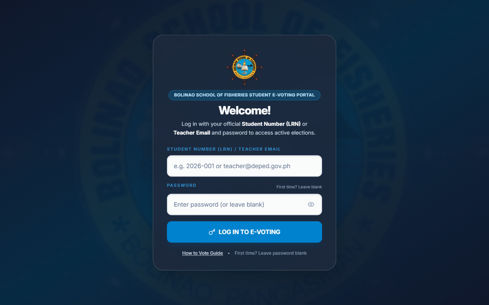  
*Figure 1: Bolinao School of Fisheries Student E-Voting System – Login Page (Desktop View)*

---

## 3. Logging In

Authorized users authenticate into the system using their assigned credentials based on role.

### A. Student Voter Login Procedure
* **Step 1:** Enter your 12-digit Learner Reference Number (LRN) into the **Student Number** input field.
* **Step 2:** Enter your personal account password. (Click the eye icon to verify input).
* **Step 3:** Click **Sign In to Ballot**.
* **Step 4:** The system authenticates your credentials and loads the active voting ballot.

### B. First-Time Password Setup for Imported Students
Students imported via DepEd SF1 rosters without pre-set passwords will see a first-time setup prompt:
* **Step 1:** Enter your Student LRN on the login screen and click **Sign In**.
* **Step 2:** The **First-Time User Password Setup** dialog will appear displaying your full name.
* **Step 3:** Enter your chosen personal password (minimum 6 characters).
* **Step 4:** Re-type your password in the **Confirm Password** field.
* **Step 5:** Click **Create Password & Continue** to complete your account setup and enter the ballot.

### C. Administrator and Faculty Login
* **Step 1:** Enter your administrative account name (e.g., `ADMIN`).
* **Step 2:** Enter your secure administrative password.
* **Step 3:** Click **Sign In**.
* **Step 4:** The system loads the Administrator Control Center.

### D. How to Cast Your Ballot Guidance
Voters unfamiliar with the digital voting process can click the **How to Vote** link on the login card to review the step-by-step voting guide prior to entering credentials.

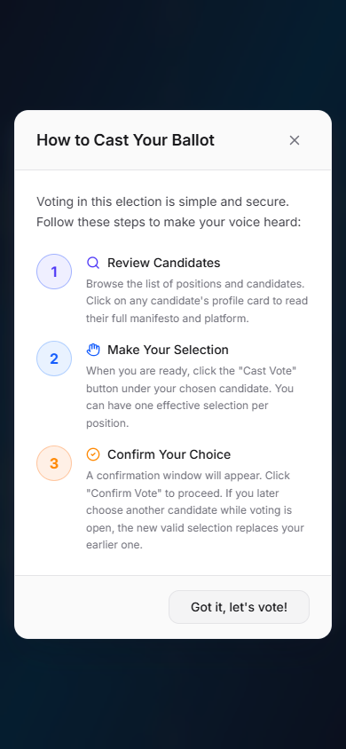  
*Figure 2: Informational "How to Cast Your Ballot" Modal*

### If Login Fails:
- Verify that your Student LRN has exactly 12 digits without spaces or hyphens.
- Ensure Caps Lock is disabled.
- Check with the precinct poll clerk if your name is listed on the official DepEd SF1 enrollment roster.
- If your password is forgotten, request an authorized Administrator to perform a credential reset.

---

## 4. Registering a User and Bulk SF1 Import

Only authorized administrators can register accounts and manage voter directories.

### A. Manual User Registration
* **Step 1:** Log in as an Administrator.
* **Step 2:** Click **Users** on the navigation menu.
* **Step 3:** Click the **+ Add User** button.
* **Step 4:** Enter student details: Student Number (LRN), Full Name, Grade Level (7–12), Section (e.g., Glassfish, Sailfish), and designated Voting Room.
* **Step 5:** Select the appropriate role: `Student`, `Teacher/Proctor`, or `Admin`.
* **Step 6:** Click **Save User** to register the account.

### B. Bulk Importing from DepEd School Form 1 (SF1) Excel Files
* **Step 1:** In the Users tab, click **Bulk Import**.
* **Step 2:** Select the **Upload File** tab or drag and drop your spreadsheet.
* **Step 3:** Select the DepEd SF1 Excel masterlist (e.g., `SF1_2026_Grade 7 (Year I) - GLASSFISH (1).xls`).
* **Step 4:** The system extracts LRNs, student full names, grade levels, and sections automatically.
* **Step 5:** Review the validation preview table to ensure all rows are formatted correctly.
* **Step 6:** Click **Import Students**. The students are added to the directory without initial passwords, enabling self-service password creation on first login.

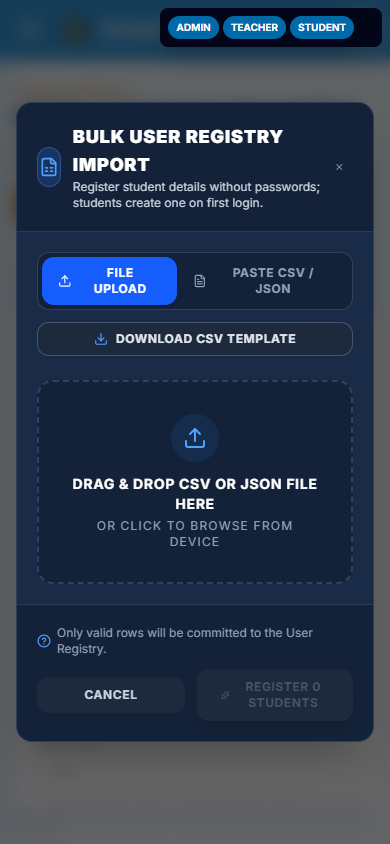  
*Figure 3: Bulk User Registry Import Dialog (DepEd SF1 Parser)*

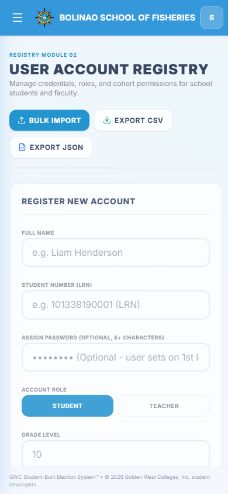  
*Figure 4: User Directory and Voter Roster Management Tab*

---

## 5. Configuring an Election Event

Before balloting can begin, an election event must be configured and scheduled.

* **Step 1:** Navigate to the **Elections** tab on the navigation drawer.
* **Step 2:** Click **+ Create Election**.
* **Step 3:** Specify the **Election Title** (e.g., *Supreme Secondary Learner Government General Election 2026–2027*).
* **Step 4:** Enter an election description summarizing rules and candidate guidelines.
* **Step 5:** Set the **Start Date & Time** (the exact moment when ballots open for students).
* **Step 6:** Set the **End Date & Time** (the exact moment when voting automatically closes).
* **Step 7:** Select the **Election Scope**:
  - `All Students`: School-wide elections.
  - `Grade Level`: Specific grades (e.g., Junior High or Senior High).
  - `Section / Room`: Targeted classroom elections.
* **Step 8:** Toggle **Enable Party-Lists** if slates or political parties are contesting the election.
* **Step 9:** Click **Save Election**. The election status reflects as `Upcoming` until the start timestamp is reached.

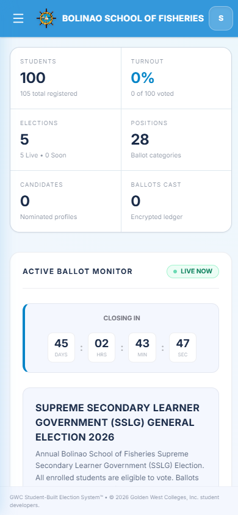  
*Figure 5: Elections Management and Scheduling Interface*

---

## 6. Managing Electoral Positions and Quotas

Positions determine the contested offices appearing on student ballots.

* **Step 1:** Click **Positions** on the navigation menu.
* **Step 2:** Select the target election from the dropdown selector.
* **Step 3:** Click **+ Add Position**.
* **Step 4:** Enter the **Position Name** (e.g., President, Vice President, Secretary, Treasurer, Auditor, Public Information Officer, Grade 7 Representative).
* **Step 5:** Set the **Ballot Order** number to enforce standard constitutional hierarchy.
* **Step 6:** Specify the **Maximum Allowable Votes** (1 for single-winner executive offices; 2 or more for multi-seat positions).
* **Step 7:** Click **Save Position**.

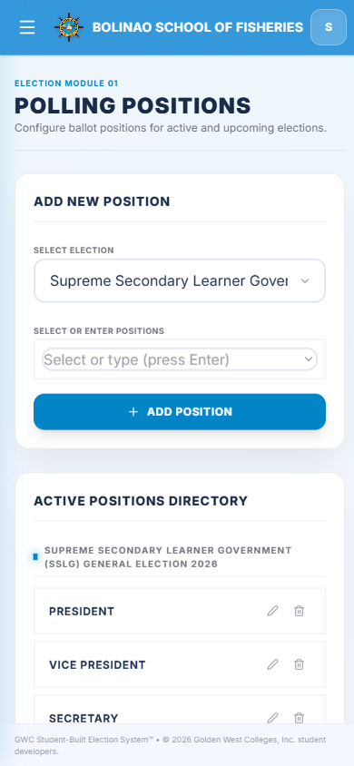  
*Figure 6: Electoral Positions and Ballot Quotas Interface*

---

## 7. Registering Candidates and Party-Lists

Candidate profiles provide photos, party affiliations, and platforms to voters.

* **Step 1:** Click **Candidates** on the navigation menu.
* **Step 2:** Click **+ Add Candidate**.
* **Step 3:** Select the target Election and Position.
* **Step 4:** Enter the candidate's Full Name or link their existing student account.
* **Step 5:** Assign their **Party-List** affiliation (or choose *Independent*).
* **Step 6:** Upload the candidate's portrait photo. Use the built-in **Image Cropping Modal** to adjust zoom and framing for uniform ballot cards.
* **Step 7:** Enter the candidate's **Platform / Manifesto** outlining their advocacies.
* **Step 8:** Click **Save Candidate**.

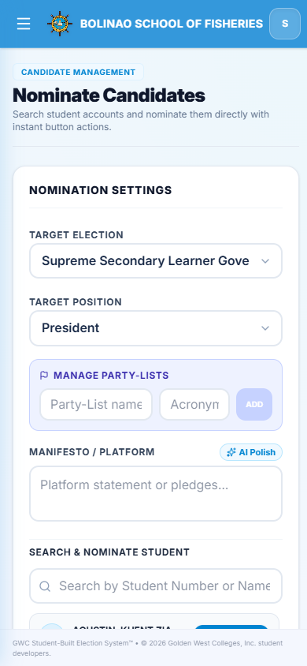  
*Figure 7: Candidates Management Interface*

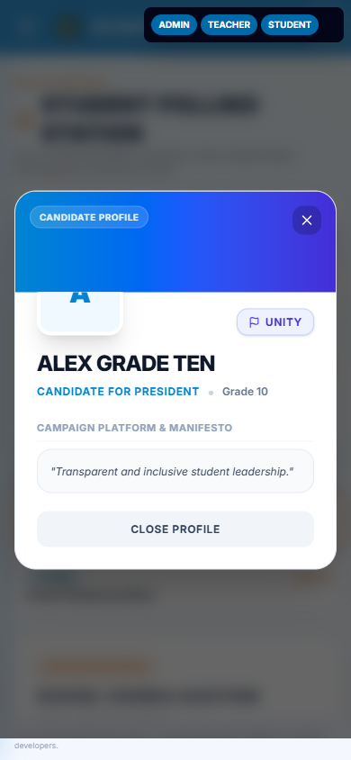  
*Figure 8: Candidate Profile and Manifesto View*

---

## 8. Checking the User and Voter Eligibility

Before allowing students into the voting booths, ensure all voter prerequisites are satisfied:

* ☑ **Active Student Account** with verified 12-digit DepEd LRN
* ☑ **Correct Grade Level, Section, and Room assignment**
* ☑ **Established password** (or ready for first-time setup)
* ☑ **Unvoted status** (`Has Voted = False`)

```
Voter Verification Flow:
ID Verification ──> SF1 Masterlist Check ──> Terminal Login ──> Active Ballot
```

If all verification checks pass, the student is cleared to proceed to the voting booth.

---

## 9. Casting a Vote (Student Voter Manual)

This is the standard digital balloting procedure for students:

* **Step 1:** Sit at an available polling kiosk and log in with your LRN and password.
* **Step 2:** The active election ballot displays with a live countdown timer showing the remaining voting time.
* **Step 3:** Browse positions in sequential constitutional order.
* **Step 4:** Click any candidate's profile card to review their photo, party affiliation, and manifesto.
* **Step 5:** Click **Cast Vote** under your chosen candidate. The selected card will highlight in blue with a checkmark badge.
* **Step 6:** Continue voting for each position. The system will prevent exceeding the maximum allowable vote quota.
* **Step 7:** Once all selections are made, click **Review Ballot** at the bottom of the screen.
* **Step 8:** The **Vote Confirmation Modal** displays a complete summary of your choices.
* **Step 9:** Carefully review your ballot. If you wish to make changes, click **Cancel** to return.
* **Step 10:** If satisfied, click **Confirm Vote**.
* **Step 11:** The system triggers an animated ballot drop celebration confirming receipt of your ballot.
* **Step 12:** A cryptographic confirmation token is generated. Click **Finish & Log Out** to clear the screen for the next voter.

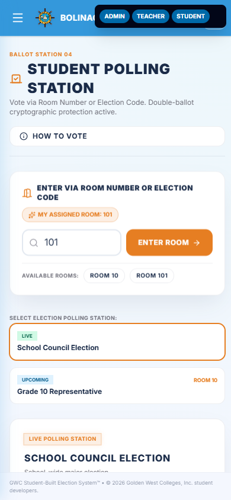  
*Figure 9: Student Digital Voting Ballot Interface*

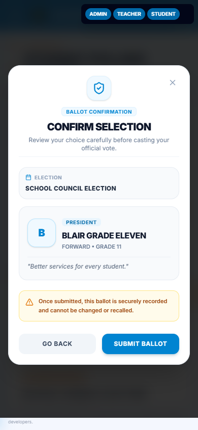  
*Figure 10: Ballot Review and Confirmation Modal*

---

## 10. Real-Time Monitoring and Unvoted Voter Tracking

Election officials can track turnout and participation in real time:

* **Step 1:** Log in to the Administrator Dashboard.
* **Step 2:** Review summary tiles for Total Voters, Ballots Cast, Turnout Percentage, Positions, and Candidates.
* **Step 3:** Inspect real-time turnout progress bars across Grade Levels and Sections.
* **Step 4:** Open the **Results** tab and click the **Unvoted Students** sub-tab.
* **Step 5:** Search by Section or Room to identify students who have not yet voted.
* **Step 6:** Coordinate with section proctors to call pending voter batches to the polling center.

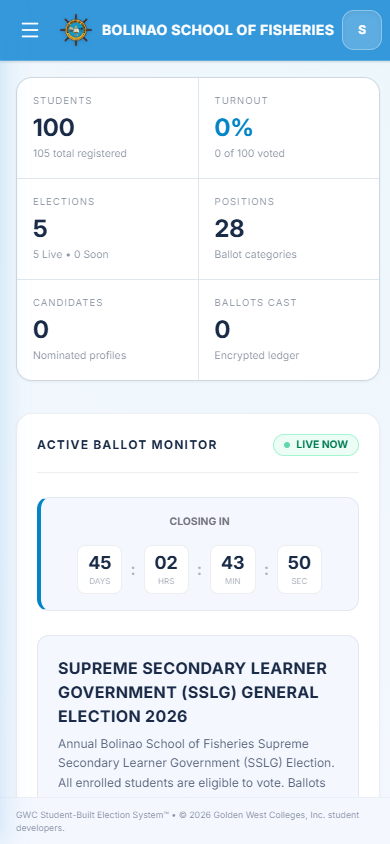  
*Figure 11: Administrator Dashboard Overview*

---

## 11. Canvassing and Viewing Election Results

The system performs instant, automated canvassing and vote tallying:

* **Step 1:** Click **Results** on the navigation menu.
* **Step 2:** Select the target election from the dropdown selector.
* **Step 3:** Observe the live vote tallies for each contested position.
* **Step 4:** Review the **Winner Podium** highlighting the leading candidates with Gold, Silver, and Bronze badges.
* **Step 5:** Inspect the interactive **Donut Charts** illustrating percentage distributions of votes cast.
* **Step 6:** When the election schedule reaches the cutoff time, the system status shifts to `Ended`, locking all vote counts.

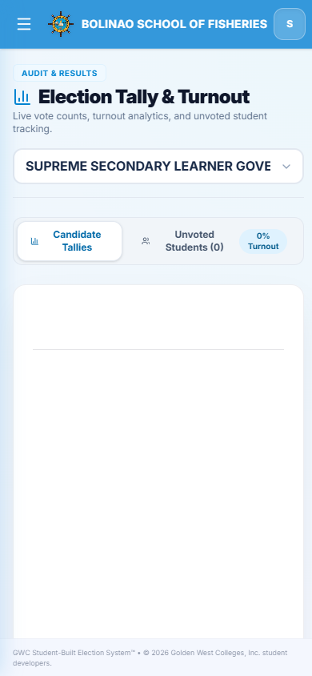  
*Figure 12: Live Canvassing, Podium Leaderboard, and Results Charts*

---

## 12. Generating a Report

Official documentation can be generated for institutional certification:

* **Step 1:** In the Results tab, click **Generate Official Certificate of Canvass**.
* **Step 2:** Verify the generated summary showing registered voters, ballots cast, turnout rate, and candidate rankings.
* **Step 3:** Click **Export Report** to download the document in PDF or Excel spreadsheet format.
* **Step 4:** Submit the printed Certificate of Canvass to the School Election Committee, Head Teacher, and School Principal for official signing.

---

## 13. When a Student Cannot Log In

* **Step 1:** Verify that the student entered their exact 12-digit DepEd LRN without hyphens or spaces.
* **Step 2:** Ensure Caps Lock is turned off.
* **Step 3:** If the student forgot their password:
  - The student reports to the Election Help Desk proctor.
  - The proctor locates the student in the User Management tab and clicks **Reset Password**.
  - The student returns to the kiosk, enters their LRN, and establishes a new password.
* **Step 4:** If the system reports `Account Not Found`:
  - Verify against the official DepEd SF1 enrollment roster.
  - If enrolled late, the administrator clicks **+ Add User** to register the student.

---

## 14. When a Vote Cannot Be Cast

* **Step 1: Check Election Schedule Status**: Voting is only permitted when the election status is `Live`. If `Upcoming`, wait for the scheduled start time; if `Ended`, the election is closed.
* **Step 2: Check Election Scope**: If an election is restricted to a specific Grade Level or Section, confirm the student's profile matches the targeted cohort.
* **Step 3: Check "Has Voted" Status**: The system enforces a strict one-student, one-vote rule. Once a ballot is submitted, subsequent attempts are blocked.
* **Step 4: Check Vote Quotas**: Ensure selections do not exceed the position's maximum allowed candidate quota.

---

## 15. Manual Verification Procedures

When automated verification requires human intervention:

* **Step 1:** The voter presents their physical DepEd School ID or Certificate of Registration to the poll clerk.
* **Step 2:** The poll clerk verifies the student's name and LRN against the printed DepEd SF1 enrollment masterlist.
* **Step 3:** The poll clerk confirms the voter's status in the digital directory to ensure they have not already voted.
* **Step 4:** Follow the approved manual verification procedure and guide the student to an available voting kiosk.
* **Step 5:** Never create duplicate accounts for a student who has already voted.

---

## 16. Common Problems and Troubleshooting Matrix

| Problem | What to Do |
| :--- | :--- |
| **Cannot log in** | Check 12-digit Student LRN and password; turn off Caps Lock. |
| **First-time login prompt appears** | Enter and confirm a secure new personal password (min. 6 characters). |
| **Student account not found** | Check LRN spelling; cross-reference DepEd SF1 enrollment roster; contact administrator. |
| **System reports 'Already Voted'** | Voters can only cast a ballot once. Duplicate voting is mathematically prohibited. |
| **Election status shows 'Upcoming'** | Voting has not commenced yet. Await the scheduled election start time. |
| **Election status shows 'Ended'** | The election deadline has elapsed. The voting window is permanently closed. |
| **Positions missing on ballot** | Verify election scope settings; some positions are restricted to specific grade levels. |
| **Candidate photo fails to upload** | Ensure image format is PNG, JPG, or WEBP and file size is below 5 MB. Re-crop using image tool. |
| **DepEd SF1 bulk import error** | Ensure file is in .xls or .xlsx format with LRN and Student Name column headers. |
| **Ballot submission is slow or hangs** | Check precinct Wi-Fi or LAN connection; do not close browser until confirmation receipt appears. |
| **Turnout percentage not updating** | Click the browser refresh button or check connection to the central server. |
| **Tablet screen distorted or clipped** | Update browser to the latest version of Chrome or Edge; rotate tablet to landscape orientation. |

---

## 17. Security and Privacy Reminders

All operators, proctors, and voters must observe the following data privacy safeguards:

* ☑ **Keep credentials confidential**: Never share passwords or LRNs with other students.
* ☑ **Do not impersonate other voters**: Voting under another student's account is strictly prohibited.
* ☑ **Observe absolute ballot secrecy**: Selections are cryptographically decoupled from voter identities.
* ☑ **Adhere to RA 10173 (Data Privacy Act of 2012)**: Student masterlists and personal data must never be distributed outside official election duties.
* ☑ **Maintain audit integrity**: Do not disclose or alter election audit logs without COMELEC authorization.
* ☑ **Restrict administrative access**: Only authorized personnel may access the User Management and Canvassing tabs.
* ☑ **Always log out immediately** after casting a vote or completing an administrative task.

---

## 18. Logging Out and Securing the Voting Terminal

After completing your voting session or administrative duties:

* **Step 1:** Click the User Profile / Avatar icon in the upper right header.
* **Step 2:** Click **Log Out**.
* **Step 3:** Wait until the system terminates your session token and redirects to the clean Login Page.
* **Step 4:** Ensure the terminal is reset to the login standby state for the next voter.

  
*Figure 13: System Ready for Next Voter (Standby Login Page)*

---
*Bolinao School of Fisheries Student E-Voting System • Developed by Golden West Colleges (GWC) Student Developers • © 2026*
